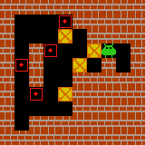

# RL289A-WQ2020
### Attempting to Solve *Sokoban* using DQN
Final project for EEC 289A Reinforcement Learning Course  

## Group Members 
  * Kolin Guo
  * Daniel Vallejo
  * Fengqiao Yang
  
## Prerequisites
  * Ubuntu 18.04
  * NVIDIA GPU with CUDA version >= 10.1
  * [Docker](https://docs.docker.com/install/linux/docker-ce/ubuntu/) version >= 19.03, API >= 1.40
  * [nvidia-container-toolkit](https://github.com/NVIDIA/nvidia-docker#ubuntu-16041804-debian-jessiestretchbuster) (previously known as nvidia-docker)  
  
Command to test if all prerequisites are met:  
  `sudo docker run -it --rm --gpus all ubuntu nvidia-smi`
  
## Setup Instructions
  `bash ./setup.sh`  
You should be greeted by the Docker container **openaigym** when this script finishes. The working directory is */* and the repo is mounted at */RL289A-WQ2020*.  

## Running Instructions
  * Training from scratch  
  `python3 src/train.py`  
  Resume training from a checkpoint file  
  `python3 src/train.py --checkpoint_dir checkpoints/DQN_Train --checkpoint_file ckpt-100000`
  * Testing  
  `python3 src/test.py --checkpoint_dir checkpoints/DQN_Train`
  * Playing (generating game-play examples using training checkpoints)  
  `python3 src/play.py --checkpoint_dir checkpoints/DQN_Train --checkpoint_file ckpt-100000`  
  
  Some other available arguments can be viewed with `--help` option. 

## Presentation and Report
Our final presentation (with embedded audio) and report can be found in [docs/](docs) folder.  
Some additional improvements (CNN+LSTM model, deadlock detection algorithm, A3C algorithm) are discussed at the end of our presentation. 
